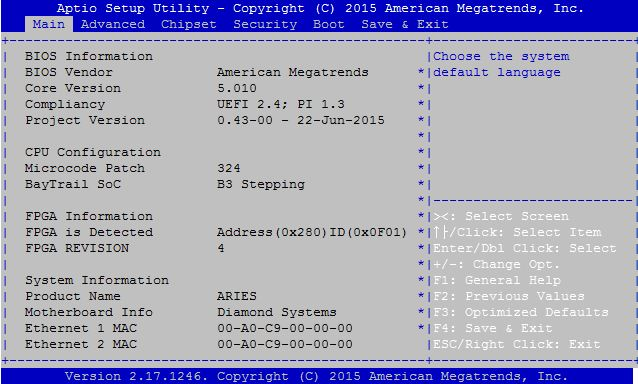
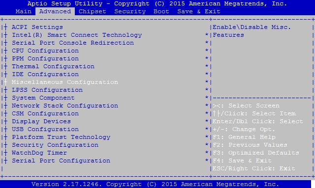
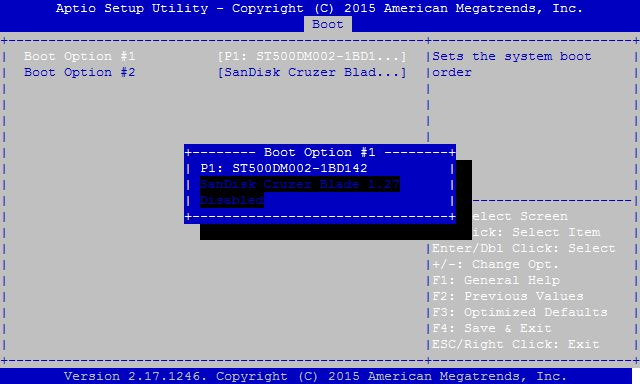

# 7.1 Checking BIOS to ensure BSP disk is selected in boot disk priority

The BIOS setup screen may be entered during startup by pressing the Delete key on an attached keyboard. Press the key repeatedly right after power-on or reset until the BIOS screen appears. After a certain amount of time during startup, the BIOS will ignore the Delete key. If you wait too long and the system does not respond, simply reset the system \(or power down\) and try again.

During SBC startup, press Delete key to enter BIOS setup screen.

* Use Mouse or Right/left arrow key to select Advanced-&gt; Miscellaneous Configuration

And press Enter

* Select OS type as Linux for QNX

* Make sure the SATADOM is selected as first boot device
* The following picture shows that the first boot device is some other device
* Select Hard Drive BBS Priorities

* Select desired as Hard disk as first boot device \( SATADOM\)

* Select Boot option \#1: Choose first boot device as SATADOM

* Go to “Save & Exit Setup” and select “Save Changes and Exit “ option then press enter key

