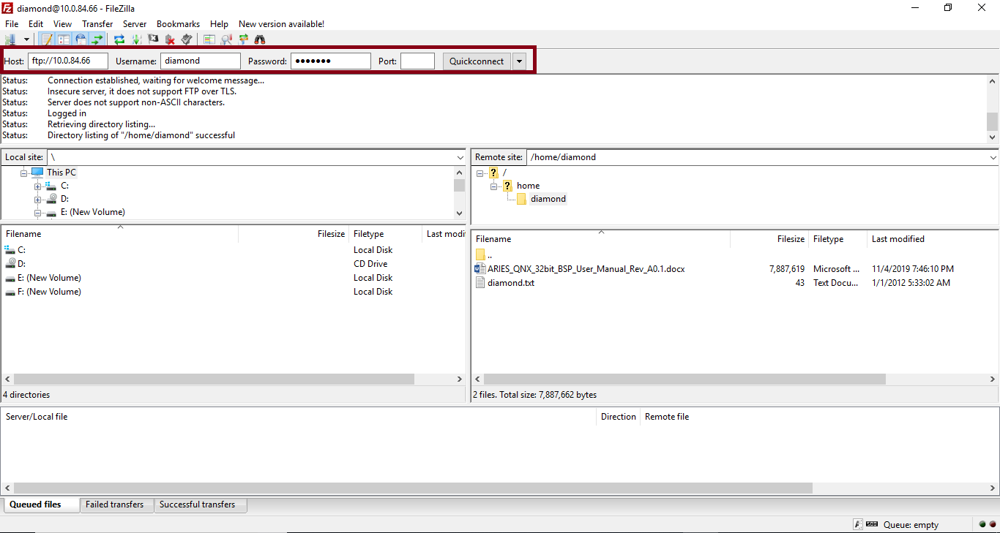
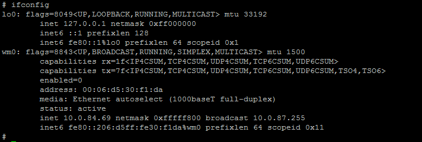
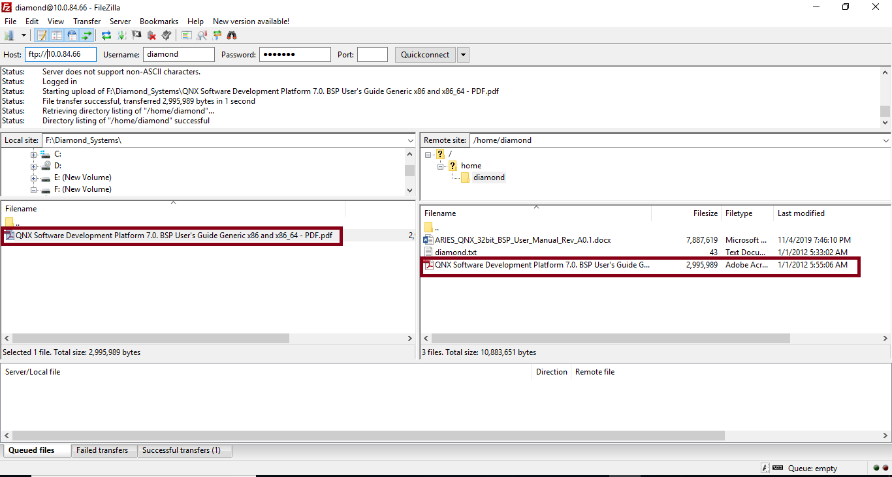
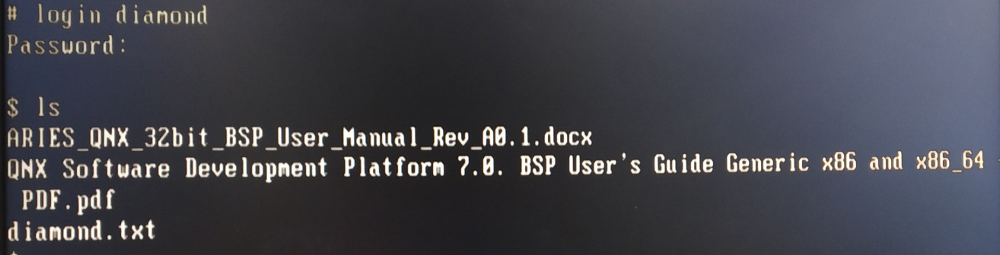

# APPENDIX A: TESTING FTP SERVER

Open any FTP application like Filezilla in development PC and type the following address in Host field. Then enter the QNX username and password and click on Quickconnect.

Host : _ftp: // &lt; IP address of Aries board&gt;_ 

Example: 

[_`ftp://10.0.84.71`_](ftp://10.0.84.71/)

Username: diamond

Password : diamond

**Note:** To know the IP address assigned to the Aries board, type the following command in terminal as shown in the image below.

_`$ifconfig`_

Once the IP status is active, take a note of the address to connect to the FTP server applications.

Once the files are successfully transferred check that files by logging into QNX user account.

