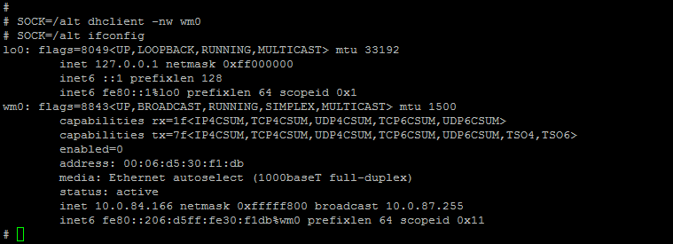

# Step 2: Ethernet Connection in LAN Controller2

Connect the LAN cable in the Ethernet controller2 port and check the IP address using the command ‘_SOCK=/alt ifconfig_’. If IP is not assigned then use the dhclient command as below for assigning the IP address.

**Command to check IP address:**

_`# SOCK=/alt ifconfig`_

**Command to startup the connection:**

_`# SOCK=/alt dhclient –nw wm0`_  

* Use below command for ping with network service,

  
_`# SOCK=/alt ping google.com`_

