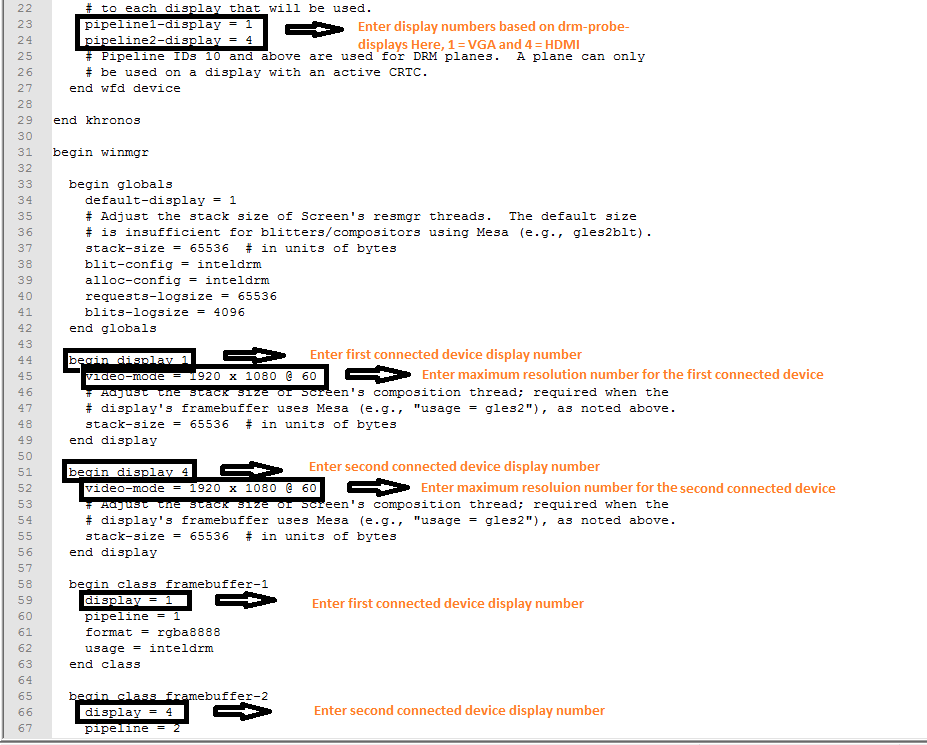

# Step 3: Graphics Configuration File Setup

In the putty terminal, enter the command _“drm-intel_” and then _“drm-probe-displays”_  for checking the connected display devices.

_`# drm-intel`_

Once this command got executed QNX machine screen gets blank.

_`# drm-probe-displays`_  


Executing the above command displays the devices display name and its display number as shown in the image below. Here all the display devices has been connected and enabled in BIOS setup as shown in Step1.


Here,

Display 1 - Embedded Display Port is LVDS and its shown the supported display resolution modes.  
Display 2 - VGA display connected and its shown the supported display resolution modes.  
Display 3 - Display Port not connected.  
Display 4 - HDMI-A which is HDMI connected devices and its shown the supported display resolution modes.

Inorder to run the graphic applications, we have to setup the graphics configuration file based on the connected devices display numbers. Graphic configuration file will be present on the _“/lib”_ path with the name of _graphics.conf._

_`# cd /lib/`_

Here you can able to see the config file **graphics.conf** using _“ls”_ command.


Copy the config file through USB and change the configurations as given in the steps below.

Open the config file using NotePad++ application in host machine. Below config file format will have LVDS and VGA display combinations.

```text
begin khronos

   begin egl display 1
      egl-dlls = libglapi-mesa.so libEGL-mesa.so
      glesv1-dlls = libglapi-mesa.so libGLESv1_CM-mesa.so
      glesv2-dlls = libglapi-mesa.so libGLESv2-mesa.so
      gpu-dlls = gpu_drm.so
   end egl display
   
begin wfd device 1
   wfd-dlls = libwfdcfg-intel-generic.so libWFDintel-drm.so

   # Run "drm-probe-displays" to list the available displays and pipelines,
   # and "use $GRAPHICS_ROOT/libWFDintel-drm.so" for more information on
   # these driver-specific settings.
   
   # Here is displays map for Intel NUC DN2820FYKH:
   # display 1: DisplayPort (not available physically on NUC)
   # display 2: HDMI-A
   
   # Pipeline IDs 1 to 9 are used for DRM CRTCs. One should be assigned
   # to each display that will be used.
   pipeline1-display = 1
   pipeline2-display = 2
   # Pipeline IDs 10 and above are used for DRM planes. A plane can only
   # be used on a display with an active CRTC.
 end wfd device
 
end khronos

begin winmgr

   begin globals
      default-display = 1
      # Adjust the stack size of Screen's resmgr threads. The default size
      # is insufficient for blitters/compositors using Mesa (e.g., gles2blt).
      stack-size = 65536 # in units of bytes
      blit-config = inteldrm
      alloc-config = inteldrm
      requests-logsize = 65536
      blits-logsize = 4096
   end globals
   
begin display 1
   video-mode = 1920 x 1080 @ 60
   # Adjust the stack size of Screen's composition thread; required when the
   # display's framebuffer uses Mesa (e.g., "usage = gles2"), as noted above.
   stack-size = 65536 # in units of bytes
end display

begin display 2
   video-mode = 1024 x 768 @ 60
   # Adjust the stack size of Screen's composition thread; required when the
   # display's framebuffer uses Mesa (e.g., "usage = gles2"), as noted above.
   stack-size = 65536 # in units of bytes
end display

begin class framebuffer-1
   display = 1
   pipeline = 1
   format = rgba8888
   usage = inteldrm
end class

begin class framebuffer-2
   display = 2
   pipeline = 2
   format = rgba8888
   usage = inteldrm
end class

end winmgr
```

Above commands should be changed according to drm-probe-displays.  


In the BIOS setup if we are disabling the LVDS display then _“drm-probe-display”_ shows Display 1 for VGA then change the commands in the config file as shown in the image below.  


For example, Below image has been configured according to VGA and HDMI combinations.



Once the configuration changes has been done, save the file and replace the file in QNX system in the same path of _`/lib/graphics.conf`_  


**Note:** Don’t change the conf file name. It should be graphics.conf

