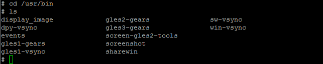
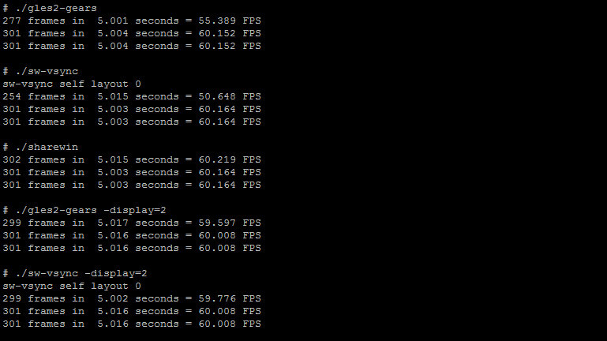

# Step 5: Running Graphic Animation Applications

We have verified three types of graphics animation applications in QNX 7.0 OS to confirm that all the necessary drivers are available for Screen to run the Graphics. Then go to _“/usr/bin_” by using the command..

_`# cd /usr/bin`_

_`# ls`_

From the list below, we can pick three applications to test.

Run the applications one by one as shown in the image below and check it in the display devices.

#### \*\*\*\*[**Gears Application**](gears-application.md)\*\*\*\*

#### \*\*\*\*[**Sync Application**](sync-application.md)\*\*\*\*

#### \*\*\*\*[**ShareWin Application**](sharewin-application.md)\*\*\*\*

