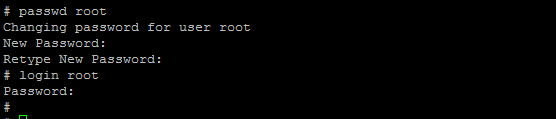

# Step 1: Steps to change existing user accounts password

In the terminal enter the below commands to change the existing user passwords.

_`# passwd dscguest`_

It will ask you a new password and re-enter the same password when it asks for reconfirmation.

_`# < enter new password for dscguest >`_

_`# < re-enter password for dscguest >`_

We have to follow the same steps for Diamond user.

_`# passwd diamond`_

It will ask for you a new password and re-enter the same password when it asks for reconfirmation.

_`# < enter new password for diamond >`_

_`# < re-enter password for diamond >`_

Same steps for Root user as well as shown in the image below.

