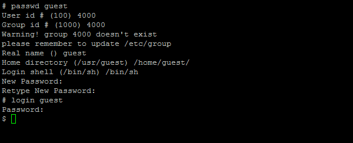

# Step 2: Steps to create new user

Login as root user with its password. Once you become root user , enter "_passwd newuser_" command.

**Command Format:**

_`# passwd <newuser>`_

_**Example:**  
`# passwd guest`_

* It will ask for you a user id, enter the value as _‘4000’_ based on the existing user ids since diamond user has 1000 and dscguest has 2000 already.
* Reenter the same value for Group id.
* It will ask Real name for the user, enter _“&lt; newuser name &gt;”._
* It will ask “Home Directory”, enter _“/home/&lt;username&gt;”._
* It will ask “Login shell”, enter _“/bin/sh”._
* It will ask ”New Password”, enter “new password for created user”.
* When it asks for reconfirmation. Re-enter the same password.

