# APPENDIX H: QNX IMAGE RE-FLASHING

If SATADOM is corrupted, try the steps given in [trouble shooting section](6.-troubleshooting/) to recover the QNX OS.

If the QNX OS could not recover, follow this section to re-flash the QNX image. The following files are present in DVD which received along with Aries SDK kit

**Files required**

* QNX BSP files

ARS\_QNX7.0\_32-Bit\_32GB folder with following files

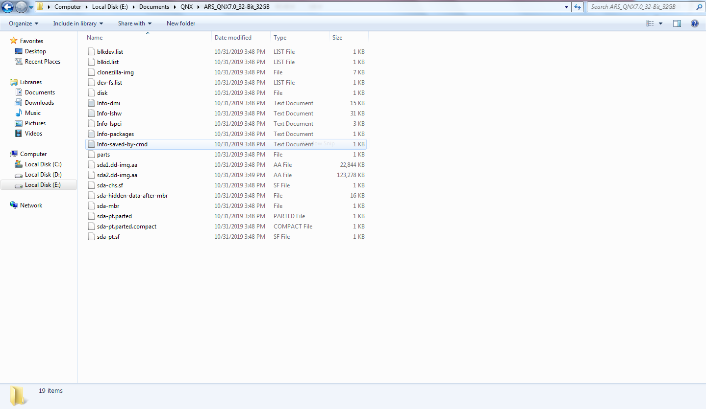

* clonezilla-live-2.5.0-25-i686– CloneZilla OS
* tuxboot-0.8.3.exe – To make a pen drive CloneZilla OS bootable

**Setup Requirements**

* SATADOM of 16GB – Target media
* Two 8 GB pen drives
* First 8 GB pen drive – To have ARS\_QNX7.0\_32-Bit\_32GB folder
* Second 8 GB pen drive – To have CloneZilla OS bootable
* A development PC with windows 7 OS – To make a pen drive as CloneZilla OS bootable

**Make an 8 GB pen drive as CloneZilla OS bootable:**

* Connect the 8 GB pen drive to a windows PC
* Run tuxboot-0.8.3.exe and it will show the pen drive in bottom.

* Select disk image and browse “clonezilla-live-2.5.0-25-i686” file and click ok.

* It will start copying files as follows

* Finally it will show the following screen, click exit and now the pen drive is CloneZilla OS bootable

**Store QNX BSP image to new/corrupted SATADOM using CloneZilla OS**

* Copy ARS\_QNX7.0\_32-Bit\_32GB folder to a pen drive
* Connect SATADOM to Aries board
* Connect CloneZilla bootable pen drive to Aries board
* Connect pen drive which has ARS\_QNX7.0\_32-Bit\_32GB folder to Aries board
* Power on the board and boot to BIOS setup \(by continuously pressing DEL key during boot up\)
* Go to Boot-&gt;Hard disk priorities then choose CloneZilla pen drive as first boot device
* Press F4 and save.
* It will boot to CloneZilla OS as follows and select first option and press enter

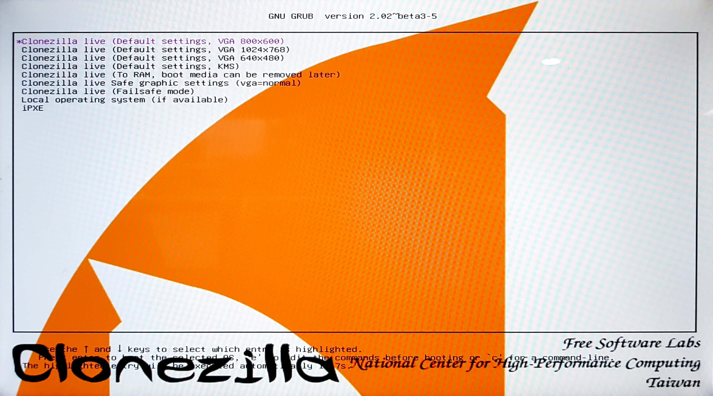

* Choose language

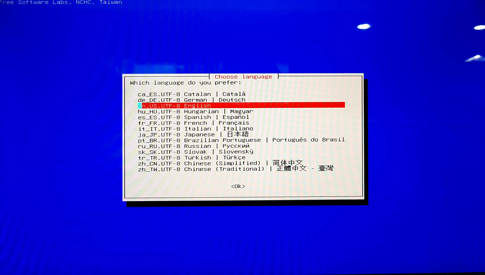

* The default keyboard layout is US keyboard, therefore if you are using US keyboard, just press enter \(i.e. use the option "Don't touch keymap"\)

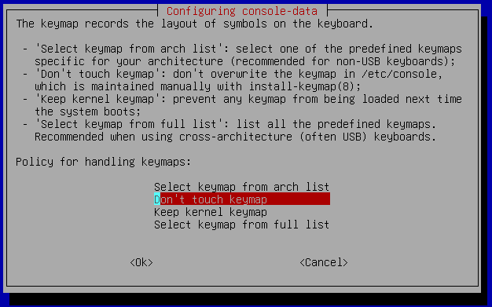

* Select following option

* Attach pen drive which is having Aries QNX 32 bit image. Select following option

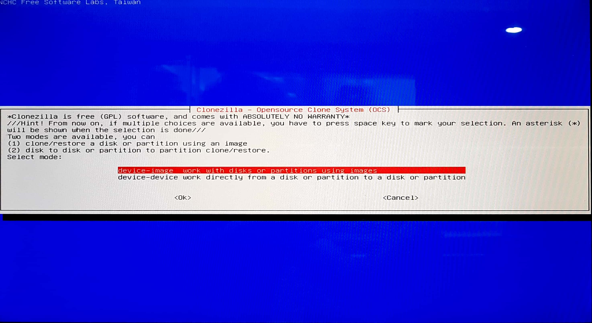

* Select following option

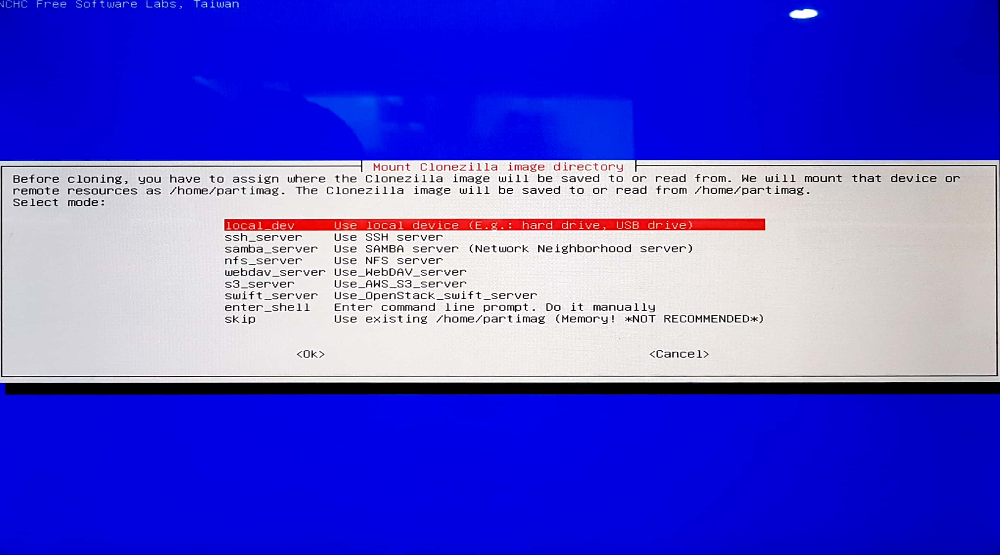

* Press Enter to continue

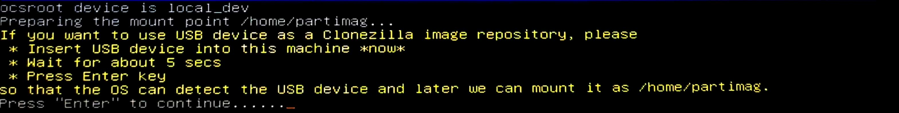

* Wait until the pen drive which has ARS\_QNX7.0\_32-Bit\_32GB\_BSP\_Image folder is detected, once it detects then press “Ctrl+C”. \(Remove ARS\_QNX7.0\_32-Bit\_32GB\_BSP folder contained pen drive and note pen drive name for reference.\)

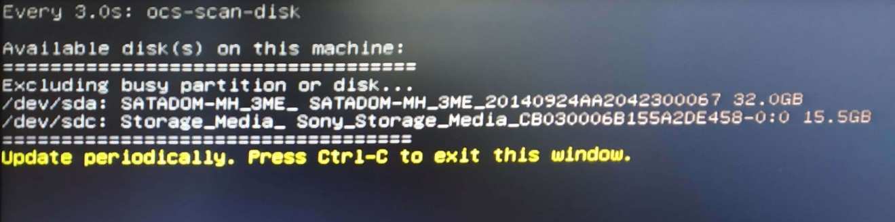

* Select the pen drive which has ARS\_QNX7.0\_32-Bit\_32GB\_BSP Image folder, the following is an example, so Choose the pen drive correctly

* Select “ARS\_QNX7.0\_32-Bit\_32GB\_BSP\_IMAGE” option and click onto “Done” using “Tab” button.

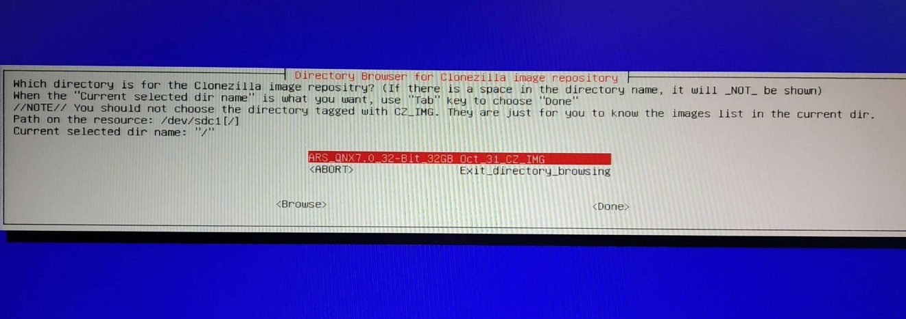

* Press enter to continue for next step.

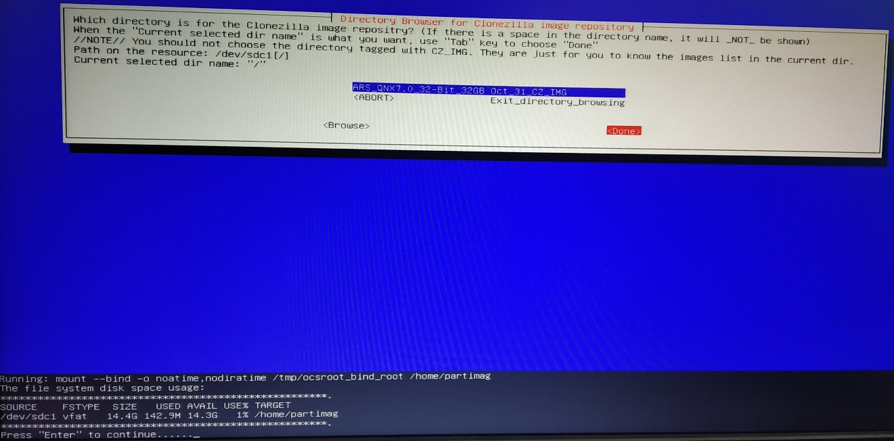

* Select following option.

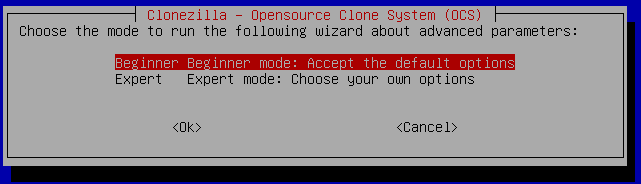

* Select following option

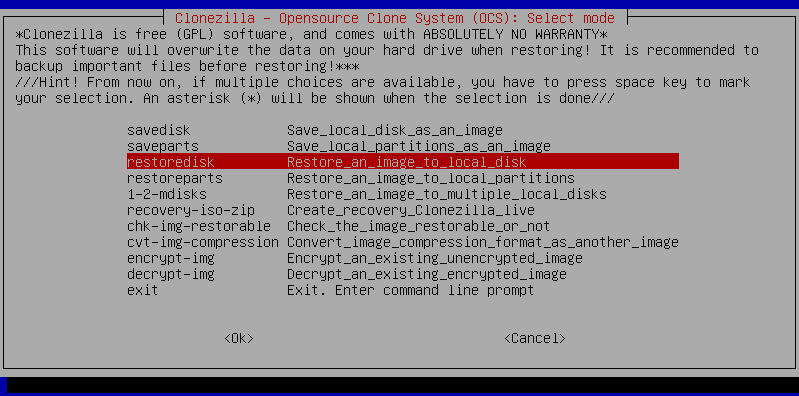

* Select following option

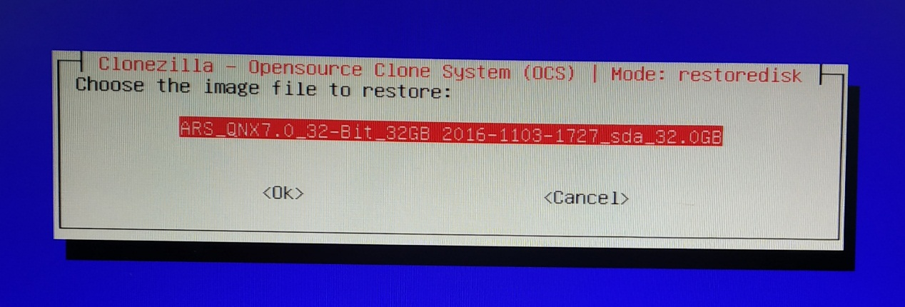

* Select the SATADOM to restore/copy the QNX 32-bit BSP image

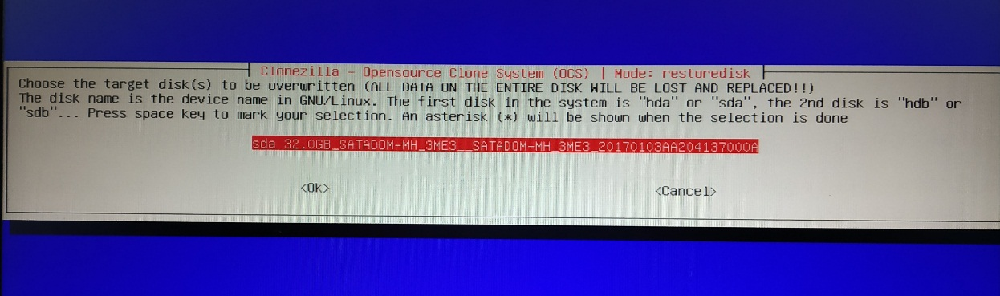

* Select following option.

* Select following option.

* Press Enter to continue

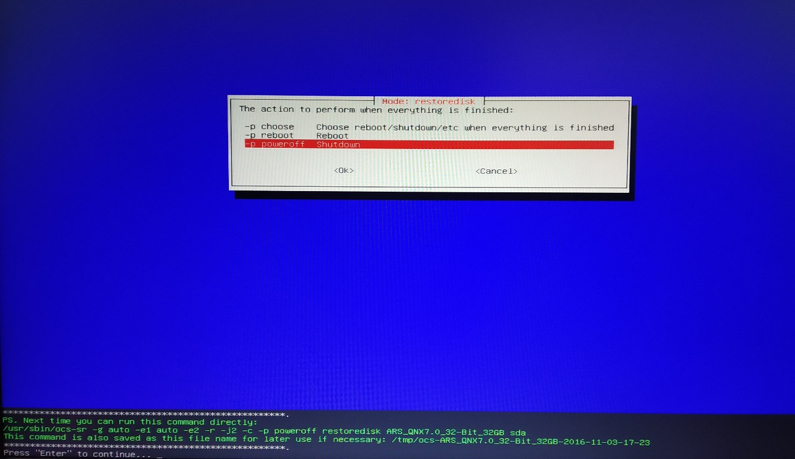

* Type “y” to continue.

* Then it will start copying the image to SATADOM.

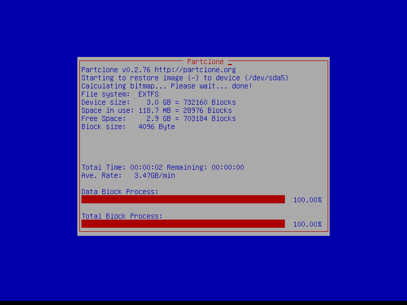

* Once Copying is done, press enter to continue.

* Select Power off.

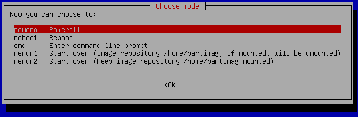

* Now the SATADOM is ready to boot to Aries QNX 32 bit.

