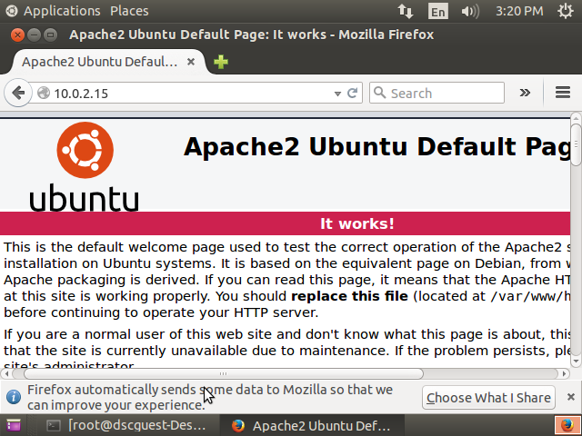

# Appendix C: Configuration of HTTP server

The chapter will show the steps to be followed to install Http server installation in Ubuntu 20.04.1 live operating system.

**Step 1:** **Installing the HTTP Web Server on Ubuntu.**

Open the terminal.

Switch to root user.

 ****$ su root

 enter the root login password

Type the command.

 ****$ apt-get install apache2

**Step 2: Create and serve our own webpages to user**

Copy the desired html files to the following directory.

 ****$ cp example.html /var/www/html/

For Example if user wants to view Diamond system webpage. Copy the Diamond system html page to the above mentioned directory.

 $ cp Diamond.html /var/www/html/

**Step 3: Testing the HTTP Server**

To confirm HTTP server works properly, type the followings in web browser address space.

http://&lt;IP address of Athena-IV board &gt; example [http://10.0.0.1](http://10.0.0.1/)

A window with a message “It Works !”appears.

To view copied desired html files in web browser, example to view Diamond webpage, type the followings in web browser address space.

http://&lt;ipaddress of target board/ Diamond.html &gt; \(ex: [http://10.0.0.1/](http://10.0.0.1/Diamond.html) Diamond.html\)

**Note:** To know the IP address assigned to the Athena-IV board, type following command in terminal

**$ifconfig**

