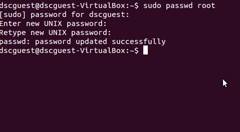
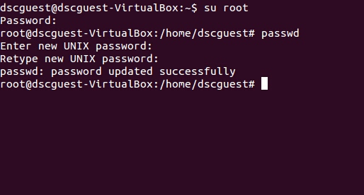

# Appendix H: To create and change of Root user password, Ubuntu new user creation

**Step 1:** **Steps to create Root user password:**

* Open terminal

        $sudo passwd root

        enter dscguest password

* It will ask for you a new password and reenter the same password when it asks for reconfirmation.

        enter new password for root

        re-enter password for root.

* It will show updated password successfully.

 **Step 2: Steps to change Root user password:**

* Switch to root user

        **$su root**

        enter the existing root user password

* To change the root password, type as

        **$passwd**

* It will ask for you a new password and re-enter the same password when it asks for reconfirmation.
* It will show updated password successfully.

**Step 3: Steps to add new user:**

* Become root user

       **$su root**

* Once you become root user , enter " adduser username" command in

       **$adduser diamond**

* It will ask for you a password and reenter the same password when it asks for reconfirmation.
* It will ask “Enter new value or Press enter for default”, press enter.
* It will ask “Is the information correct”, enter ‘y’.

