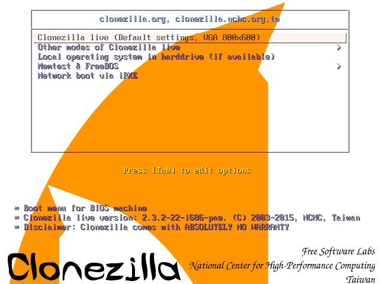
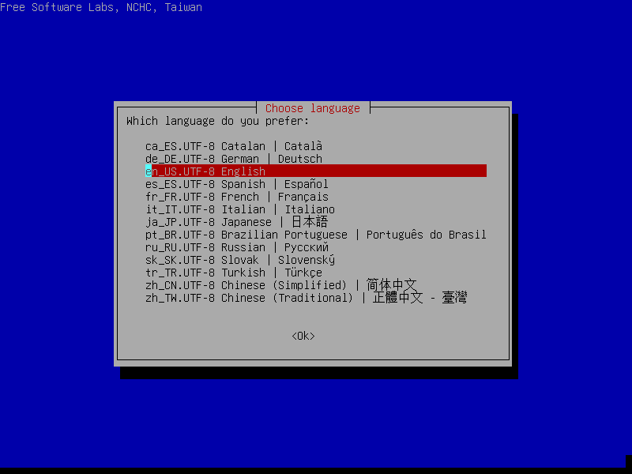
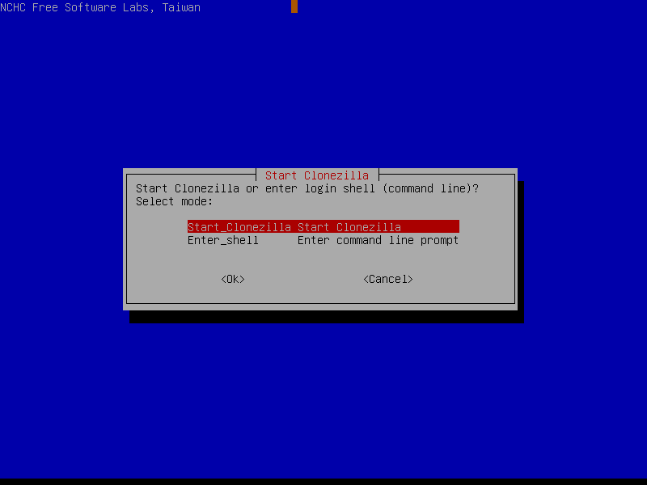
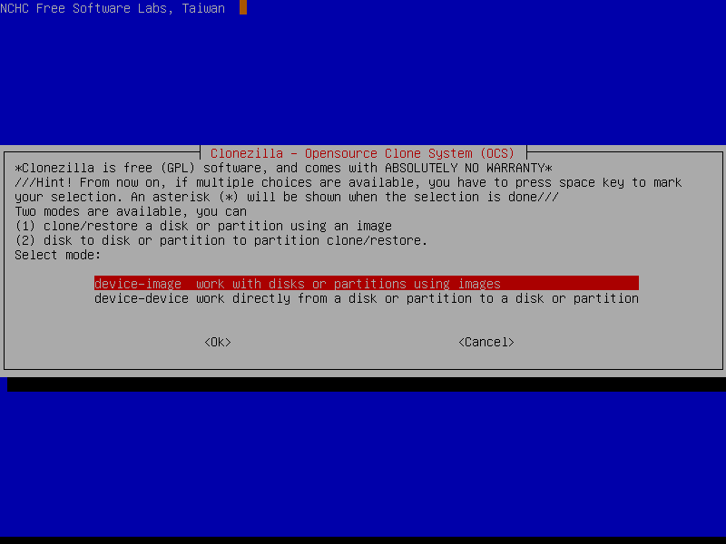

# Appendix M: Linux Image RE-flashing

If M.2 2230 SATA is corrupted, try the steps given in **trouble shooting section** to recover the Linux 20.04.1 LTS 64-bit OS.

If the Linux 20.04.1 LTS 64-bit OS could not recover, follow this section to re-flash the Linux image. The following files are present in DVD which received along with Athena-IV SDK kit

**Files required**

* Linux BSP files

ATHENA-IV\_LNX-5.4\_64-BIT\_32GB folder with following files

* clonezilla-live-20150805-vivid-i686.iso – CloneZilla OS
* tuxboot.exe – To make a pen drive CloneZilla OS bootable

**Setup Requirements**

* M.2 2230 SATA of 32GB – Target media
* Two 8 GB pen drives
* First 8 GB pen drive – To have ATHENA-IV\_LINUX\_BSP folder
* Second 8 GB pen drive – To have CloneZilla OS bootable
* A development PC with windows 7 OS – To make a pen drive as CloneZilla OS bootable

**Make an 8 GB pen drive as CloneZilla OS bootable:**

* Connect the 8 GB pen drive to a windows PC
* Run tuxboot0.8.3.exe and it will show the pen drive in bottom.

* Select disk image and browse “clonezilla-live-20150805-vivid-i686.iso” file and click ok.

* It will start copying files as follows

* Finally it will show the following screen, click exit and now the pen drive is CloneZilla OS bootable

**Store Linux BSP image to new/corrupted M.2 2230 SATA using CloneZilla OS**

* Copy ATHENA-IV\_LNX-5.4\_64-BIT\_32GB folder to a pen drive
* Connect M.2 2230 SATA to Athena-IV board
* Connect CloneZilla bootable pen drive to Athena-IV board
* Connect pen drive which has ATHENA-IV\_LNX-5.4\_64-BIT\_32GB folder to Athena-IV board
* Power on the board and boot to BIOS setup \(by continuously pressing DEL key during boot up\)
* Go to Boot-&gt;Hard disk priorities then choose CloneZilla pen drive as first boot device
* Press F4 and save.
* It will boot to CloneZilla OS as follows and select first option and press enter

* Choose language

* The default keyboard layout is US keyboard, therefore if you are using US keyboard, just press enter \(i.e. use the option "Don't touch keymap"\)

* Select following option

* Select following option

* Select following option

* Press Enter to continue

* Select the pen drive which has ATHENA-IV\_LNX-5.4\_64-BIT\_32GB folder, the following is an example ,so Choose the pen drive correctly.

* Select following option

* Press enter to continue for next step.
* Select following option

* Select following option

* Select following option

* Select the M.2 2230 SATA to restore/copy the Linux BSP image

* Press Enter to continue

* Type “y” to continue
* Then it will start copying the image to M.2 2230 SATA

* Once Copying is done , press enter to continue
* Select Power off

* Now the M.2 2230 SATA is ready to boot to Athena-IV Linux Image Ubuntu-20.04.1 LTS 64-bit OS 

