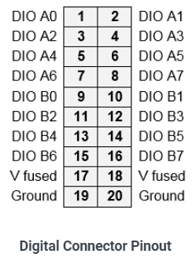

# 8.1	Digital I/O – J4

The sixteen digital I/O lines are brought out on a 20-pin pin header, J4, with the pin out shown below.

**Connector Part Number / Description**

OUPIIN 2112-2210G00R 2mm pitch dual row right angle pin header with ejector latches

