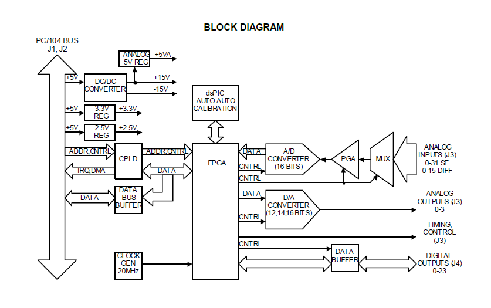

# 1. DESCRIPTION

DMM-32DX-AT is a PC/104-format data acquisition board with a full set of analog and digital I/O features. It offers 32 analog inputs with 16-bit resolution and programmable input range; 250,000 samples per second maximum sampling rate with FIFO operation; 4 analog outputs with 16-bit \(or 12-bit\) resolution; user-adjustable analog output ranges; 31 lines of digital I/O; one 32-bit counter/timer for A/D conversion and interrupt timing; and one 16-bit counter/timer for general purpose use. 

The DMM-32DX-AT is designed to be a fully backwards-compatible upgrade for the DMM-32-AT board. In addition to all DMM-32-AT features, the DMM-32DX-AT includes the following upgrades: 

* 1024-sample FIFO for A/D samples versus. 512 samples on DMM-32-AT 
* 1024-sample data buffer for D/A waveform generation 
* Software reprogrammable FPGA and dsPIC microcontroller for future feature enhancements 
* Patented auto-autocalibration feature that provides fully autonomous calibration in hardware

