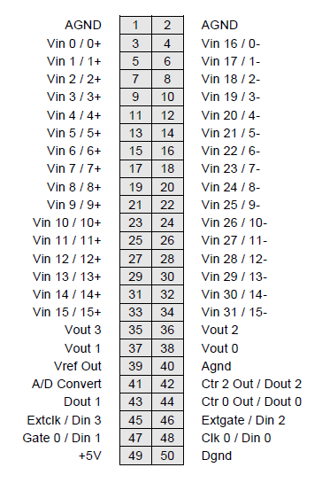

# 4.1 Analog I/O Header – J3

Diamond-MM-32DX-AT provides a 50-pin header on the right edge of the board labeled J3 for all I/O relating to analog functions. Pin 1 is in the upper left corner.

| Signal Name | Definition |
| :--- | :--- |
| Vin 15/15+ ~ Vin 0/0+ | Analog input channels 15 - 0 in single-ended mode; High side of input channels 15 - 0 in differential mode |
| Vin 31/16- ~ Vin 15/0- | Analog input channels 31 - 16 in both single-ended mode; Low side of input channels 15 - 0 in differential mode |
| Vref Out | Precision +5V signal for reference only. Do not use for power |
| Vout 0 - 3 | 16-bit standard, \(12-bit optional\) analog output channels |
| A/D Convert | A/D convert signal output; can be used to synchronize multiple boards |
| Dout 2 – Dout 0 | Digital output port with counter/timer functions |
| Din 3 – Din 0 | Digital input port with counter/timer and external trigger functions |
| Extclk | External A/D trigger input; Also used for digital interrupt \(DINT\) input |
| Extgate | Pin to control gating of Ctrs 1& 2 for A/D timing |
| Gate 0 | Pin to control gating of Ctr 0 |
| Clk 0 | Input source to Ctr 0 |
| +5V | Connected to PC/104 bus power supply |
| Agnd | Analog ground; connected to digital ground at a single point at DC/DC converter PS1 on board |
| Dgnd | Digital ground; connected to PC/104 bus ground |

       

       

