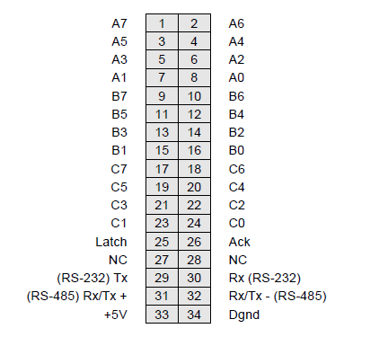

# 4.2 Digital I/O Header – J4

Diamond-MM-32DX-AT provides a 34-pin header on the left edge of the board labeled J4 for the 24 8255-type digital I/O lines. Pin 1 is in the lower left corner.

| Signal Name | Definition |
| :--- | :--- |
| A7 – A0 | Digital I/O port A |
| B7 – B0 | Digital I/O port B |
| C7 – C0 | Digital I/O port C |
| Latch | Latch control input; active high |
| Ack | Acknowledge output for interrupt-based I/O; active high |
| RS-232 Rx/Tx | RS-232 transceiver terminals to communicate with onboard dsPIC |
| RS-485  | Rx/Tx +/- RS-485 transceiver terminals to communicate with onboard dsPIC |
| +5V  | Connected to PC/104 bus +5V power supply |
| Dgnd  | Digital ground; connected to PC/104 bus ground |

Note: The operation of digital I/O Latch and Ack signals is detailed in Chapter 16.

