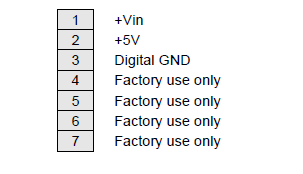

# 4.3 Serial I/O Header – J11

Diamond-MM-32DX-AT provides a 7-pin right-angle friction-lock header on the left edge of the board labeled J11 for an auxiliary power connection. The power pins may be used to provide power to the board in standalone operation \(not used in a PC/104 stack\). When the board is installed in a PC/104 stack, the +5V pin may be used as a source of +5V for auxiliary devices \(maximum current 1 Amp\) but should NOT be used for power input.

| Signal Name  | Definition |
| :--- | :--- |
| +Vin | Unregulated Power Input. This allows the board to operate in standalone mode, fed through an unregulated power supply ranging from 7 to 12VDC. This pin requires an optional voltage regulator installed on the bottom side of the board. Do not attempt to use this pin unless the regulator is installed. |
| +5V | This pin can be connected to a regulated +5VDC power supply to power the board for standalone operation |
| Digital GND | Connected to the digital ground plane of the board. |

