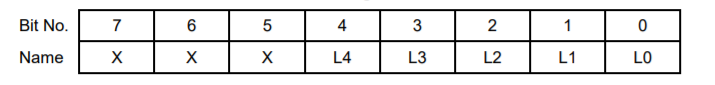
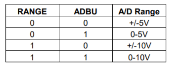
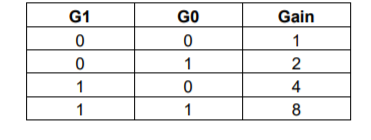

# 6.3 I/O Map Details

This section describes the location and general behavior of specific bits in each I/O map register. In all register definitions below, a bit named X is not defined and serves no function.

**Base + 0        Write        Start A/D Conversion** 

Writing to Base + 0 starts an A/D conversion, unless a conversion is already in progress \(AD\_BUSY high.\) The value written does not matter. Writing to Base + 0 will start an A/D conversion even if the board is set up for interrupt, DMA, or external trigger mode.

**Base + 0      Read       A/D LSB**

AD7-0          A/D data bits 7 - 0; AD0 is the LSB

**Base + 1      Write       Auxiliary Digital Output**

|  |  |
| :--- | :--- |
| DOUT2-0 | Auxiliary digital output bits on analog I/O header J3. Two pins also serve as optional counter outputs based on control register bits at Base + 10: |
| DOUT2 | J3 pin 42. Counter 2 output when OUT2EN = 1 \(Base + 10 bit 5\). |
| DOUT1 | J3 pin 43 |
| DOUT0 | J3 pin 44. Counter 0 output when OUT0EN = 1 \(Base + 10 bit 4\). |
| LED | This bit toggles the onboard user LED. 1 = on; 0 = off. |

**Base + 1**      **Read**          **A/D MSB**

|  |  |
| :--- | :--- |
| AD15 - 8  | A/D data bits 15 - 8; AD15 is the MSB  |

**Base + 2      Read/Write       A/D Low Channel Register**

|  |  |
| :--- | :--- |
| L4-0 | The low channel number setting in the A/D channel scan range. Channel numbers range from 0 to 31 in single-ended mode. Writing to this register updates the current channel internal register. |

**Base + 3    Read/Write     A/D High Channel Register**

|  |  |
| :--- | :--- |
| H4-0 | The high channel number setting in the A/D channel scan range. Channel numbers range from 0 to 31 in single-ended mode. |

**Base + 4     Write      DAC LSB**

This register is used to write the lower bits of a 12-bit data value to the D/A. If data is written to page 7 base + 13, then the next time base + 5 is written, the FPGA will send the data from page 7 base + 12 & 13 to the channel selected by the channel bits in base + 5. After one such cycle, the FPGA will revert to using base + 4 & 5 for the D/A data until page 7 base + 13 is written to again. If page 7 base + 13 has not been written to since the last time base + 5 was written, then when base + 5 is written, the FPGA will assemble the D/A data packet using the data in base + 4 & 5.

**Definitions:**

|  |  |
| :--- | :--- |
| DA7 - 0 | D/A data bits 7 - 0 for the channel currently being accessed. This register is a holding register. Writing to it does not affect any D/A channel until the MSB is written. When the MSB is written \(see below, Base + 5\), the value written to that register, along with the value written to this register, are simultaneously written to the D/A chip’s load register for the selected channel. See Base+5/write for more details. |

#### Base + 4     ****Read      Status / Auxiliary digital inputs

#### Definitions:

|  |  |
| :--- | :--- |
| DIN3-0 | Auxiliary digital inputs on analog I/O header J3. These pins have multiple functions based on control bits at Base + 9 and Base + 10: |
| DIN3 | J3 pin 45. External A/D clock when CLKSEL = 1 \(Base + 9 bit 0\) |
| DIN2 | J3 pin 46. Gate for counters 1 and 2 when GT12EN = 1 \(Base + 10 bit 0\) |
| DIN1 | J3 pin 47. Gate for counter 0 when GT0EN = 1 \(Base + 10 bit 2\) |
| DIN0 | J3 pin 48. Clock for counter 0 when SRC0 = 1 \(Base + 10 bit1\) |
| DACBUSY | The D/A serial transfer is in progress. Do not attempt to write to the D/A converters at Base + 4 or Base + 5 while this bit is high. This bit must be checked before any write to these registers. |
| CALBUSY | Calibration is in progress or EEPROM is being accessed. Do not attempt calibration or EEPROM access while this bit is high. This bit must be checked before any calibration or EEPROM operation is attempted. |
| ACACT | This is a copy of the value found at Page 4, Base+14, bit 1. It is mirrored at this location to provide a page-independent means of seeing the AC status, since AC uses Page 3. |
| USRDEF | User Defined Jumper Input. Reports the state of the option jumper signal J\_USR\_DEF. |

**Base + 5     Write     DAC MSB + Channel No.**

This register is used to write the upper bits of a 12-bit data value to the D/A and to select the D/A channel. If data is written to page 7 base + 13, then the next time base + 5 is written, the FPGA will send the data from page 7 base + 12 & 13 to the channel selected by the channel bits in base + 5. After one such cycle, the FPGA will revert to using base + 4 & 5 for the D/A data until page 7 base + 13 is written to again. If page 7 base + 13 has not been written to since the last time base + 5 was written, then when base + 5 is written, the FPGA will assemble the D/A data packet using the data in base + 4 & 5.

| **Definitions:** |  |
| :--- | :--- |
| DA11 – 8 | D/A bits 15 - 8 for the selected output channel; DA15 is the MSB for a 16-bit D/A output, DA13 is the MSB for a 14-bit D/A output and DA11 is the MSB for a 12-bit D/A output \(when optional 12-bit D/A converter is installed\). Bits 15-12 are enabled when P2 is set to ‘1’ |
| DACH1-0 | Binary number of the D/A channel, 3 – 0, when P2 is set to ‘0’ |
| DASIM | D/A simultaneous update when P2 is set to ‘0’. If DASIM=1 when writing to this register, the D/A conversion is “latched”, i.e. the 16-bit \(or 12-bit\) value will be loaded into the D/A converter, but the output will not change until this register is written to again with DASIM set to 0, at which point all latched D/A channels written to previously will update. Note that this is an enhanced feature. If enhanced features are disabled, DASIM will always be considered a ‘0’ for backwards compatibility, causing D/A outputs to update on every write to this register. |
| DAGEN | If this bit is ‘1’ no data is transferred to the DAC chip. This is used in conjunction with the D/A waveform generator to store the DAC code that will be written into the waveform memory block. If enhanced features are disabled, this bit is always considered ‘0’ and the data will be transferred to the DAC chip. |

**Base + 5       Read Update         All D/A Channels**

Reading from this address causes all 4 D/A channels to update with the values loaded into their load registers. Any channel which has had a new value written to it since the last update command will switch to its new value. Any channel which has not had a new value written will maintain its present value without glitching.

**Base + 6       Read / Write         FIFO Depth Register**

|  |  |
| :--- | :--- |
| FT8-1 | FIFO threshold. This is the level at which the board will generate an interrupt request when the FIFO is enabled \(FIFOEN = 1 in Base + 7\). Note that the value written is shifted by 1 bit, i.e. divided by 2. For example, if you want a FIFO threshold of 256 samples, write a 128 to this register. The interrupt routine must read exactly this number of samples out each time it runs. The last time the routine runs, it should read whatever is remaining in the FIFO by monitoring the EF bit \(Empty Flag\) in the FIFO status register at Base + 7. When the FIFO is empty, EF = 1, and the FIFO returns the value hex FF on all read operations. If you are sampling at a slow rate or want to control when the interrupt occurs, you can set the threshold to a low value. For example, if you are sampling 16 channels at 10Hz and you want an interrupt each set of samples, you can set the threshold to 16 \(write an 8 to this register\), so that an interrupt will occur each 16 samples. Then the interrupt routine should read out 16 samples from the FIFO, and you get new data as soon as it is available. For higher sample rates \(100KHz or higher\) it may be necessary to increase the threshold above 256, to around 350 or even 512 with enhanced features enabled. If you set the threshold too high, you may overrun the FIFO, since the interrupt routine may not respond before the remaining locations are filled, causing an overflow. An overflow can be detected by checking the OVF bit in the FIFO status register at Base + 7. The correct threshold for your application can only be determined by testing. |

**Base + 7          Write        FIFO Control Register**

|  |  |
| :--- | :--- |
| FIFOEN | FIFO enable: |
|      1 | Enable FIFO operation; if interrupts are enabled, interrupts will occur when the FIFO hits threshold \(TF = 1\). This slows down the interrupt rate dramatically compared to the actual A/D sample rate. |
|      0 | Disable FIFO operation; if interrupts are enabled, interrupts will occur after each A/D conversion. |
| SCANEN | Scan enable: |
|      1 | Scan mode enabled; FIFO will fill up with data for a single scan, and STS will stay high until entire scan is complete; if interrupts are enabled, interrupts will occur on integral multiples of scans. |
|      0 | Scan mode disabled; The STS bit will correspond directly to the status indicator from the A/D converter |
| FIFORST | FIFO reset: |
|      1 | Reset FIFO; after this command is issued, EF = 1, TF = 0, FF = 0 |
|      0 | No function |

See the FIFO chapter later in this manual for a complete description of FIFO operation.

**Base + 7         Read        FIFO Status Register**

|  |  |
| :--- | :--- |
| EF | Empty flag: |
|  1 | FIFO is empty |
|  0 | FIFO is not empty |
| TF | Threshold flag: |
|  1 | FIFO is at or beyond threshold; if the FIFO threshold is 256 words, this flag is set when the FIFO contains at least 256 words of A/D data. |
|  0 | FIFO is less than threshold |
| FF | Full flag: |
|  1 | FIFO is full; the next A/D conversion will result in an overflow |
|  0 | FIFO is less than full |
| OVF | Overflow flag: |
|   1 | FIFO has overflowed; data has been lost. This flag is cleared on the next successful A/D read. |
|   0 | FIFO has not overflowed since the last A/D data read |

FIFOEN, SCANEN Read-back of control bits from above

PAGE1-0 Read-back of the current page register setting; see Base + 8 below

**Base + 8      Write       Miscellaneous Control Register**

|  |  |
| :--- | :--- |
| RESETA | Writing a 1 to this bit causes a full reset of all features of the board, including the DACs, the FIFO, the digital I/O, and all internal registers. The counter/timers are not affected by this reset. |
| RESETD | Writing a 1 to this bit causes a reset identical to above except the analog outputs are not affected. |
| INTRST | Writing a 1 to this bit resets the interrupt request circuit on the board. The programmer must write a 1 to this bit during the interrupt service routine, or further interrupts will not occur. Writing a 1 to this bit does not disturb the values of the PAGE bits. |
| P2-0 | Three-bit value that selects which I/O device is accessible through the registers at locations Base + 12 through Base + 15: |

Gray pages \(2, 4, 5, 6 and 7\) are only accessible when the enhanced features are enabled. Note that P2 is an enhanced feature bit.

Writing to the page bits will not generate a board reset or interrupt reset, as long as those bits are kept at 0 in the data written to this register.

**Base + 8       Read        A/D Status Register**

|  |  |
| :--- | :--- |
| STS | A/D chip status: |
|   1 | A/D conversion or A/D scan in progress |
|   0 | A/D idle |
| S/D1-0 | Single-ended / Differential A/D input mode indicator. S/D1 controls the channels 8-15 and 24-31, S/D0 controls 0-7 and 16-23. |
|     1 | Single-ended \(default\) |
|     0 | Differential |
| ADCH4-0 | Current A/D channel; this is the channel currently selected on board and is the channel that will be used for the next A/D conversion \(unless a new value is written to the low channel register\). |

**Base + 9       Write        Interrupt and A/D Clock Control Register**

<table>
  <thead>
    <tr>
      <th style="text-align:left"></th>
      <th style="text-align:left"></th>
    </tr>
  </thead>
  <tbody>
    <tr>
      <td style="text-align:left">ADINTE</td>
      <td style="text-align:left">A/D interrupt enable:</td>
    </tr>
    <tr>
      <td style="text-align:left">1</td>
      <td style="text-align:left">Enable A/D interrupt operation</td>
    </tr>
    <tr>
      <td style="text-align:left">0</td>
      <td style="text-align:left">Disable A/D interrupt operation</td>
    </tr>
    <tr>
      <td style="text-align:left">DINTE</td>
      <td style="text-align:left">Digital interrupt enable:</td>
    </tr>
    <tr>
      <td style="text-align:left">1</td>
      <td style="text-align:left">Enable digital I/O interrupt operation.</td>
    </tr>
    <tr>
      <td style="text-align:left">0</td>
      <td style="text-align:left">Disable digital I/O interrupt operation</td>
    </tr>
    <tr>
      <td style="text-align:left">TINTE</td>
      <td style="text-align:left">Timer 0 interrupt enable:</td>
    </tr>
    <tr>
      <td style="text-align:left">1</td>
      <td style="text-align:left">Enable counter/timer 0 interrupt operation</td>
    </tr>
    <tr>
      <td style="text-align:left">0</td>
      <td style="text-align:left">Disable counter/timer 0 interrupt operation</td>
    </tr>
    <tr>
      <td style="text-align:left">RSVD1</td>
      <td style="text-align:left">Reserved for future use</td>
    </tr>
    <tr>
      <td style="text-align:left">DMAEN</td>
      <td style="text-align:left">DMA Enable. This bit is ignored if enhanced features are disabled. See
        DMA signal definition for more detail on DMA behavior.</td>
    </tr>
    <tr>
      <td style="text-align:left">1</td>
      <td style="text-align:left">DMA Enabled</td>
    </tr>
    <tr>
      <td style="text-align:left">0</td>
      <td style="text-align:left">DMA Disabled</td>
    </tr>
    <tr>
      <td style="text-align:left">CLKEN</td>
      <td style="text-align:left">Enable hardware clock for A/D sampling:</td>
    </tr>
    <tr>
      <td style="text-align:left">1</td>
      <td style="text-align:left">
        
Enable hardware clock for A/D (source is selected with CLKSEL bit below);

        
NOTE: When this bit is 1, software triggers are disabled, i.e. writing
          to Base + 0 will not start an A/D conversion.

      </td>
    </tr>
    <tr>
      <td style="text-align:left"></td>
      <td style="text-align:left">NOTE: When this bit is 1, software triggers are disabled, i.e. writing
        to Base + 0 will not start an A/D conversion.</td>
    </tr>
    <tr>
      <td style="text-align:left">0</td>
      <td style="text-align:left">Disable hardware clocking for A/D; A/D conversions occur with software
        command only</td>
    </tr>
    <tr>
      <td style="text-align:left">CLKSEL</td>
      <td style="text-align:left">Hardware clock select (enabled only when CLKEN = 1 above):</td>
    </tr>
    <tr>
      <td style="text-align:left">1</td>
      <td style="text-align:left">Internal clock: Falling edges on the output of counter/timer 2 generate
        A/D conversions. Counter 2 is in turn driven by counter 1, which is driven
        by the clock selected by bit FREQ12 in Base + 10 below.</td>
    </tr>
    <tr>
      <td style="text-align:left">0</td>
      <td style="text-align:left">External trigger: Falling edges on the DIN3/EXTCLK pin on the I/O header
        generate A/D conversions.</td>
    </tr>
  </tbody>
</table>

**Base + 9      Read     Interrupt and A/D Clock Status Register**

|  |  |
| :--- | :--- |
| ADINT | A/D interrupt status |
|    1  | A/D interrupt request has occured |
|    0 | No interrupt request |
| DINT | Digital interrupt status |
|     1 | Digital interrupt request has occured |
|     0 | No interrupt request |
| TINT | Timer interrupt status |
|     1 | Timer interrupt request has occured |
|     0 | No interrupt request |
| DMAEN | Read-back of control register bit defined above |
| P2 | Read-back of P2 register bit defined at Base+8/write |
| CLKEN | Read-back of control register bit defined above |
| CLKSEL | Read-back of control register bit defined above |

ADINT, DINT and TINT are cleared by writing to INTRST \(base+8\)

**Base + 10         Read/Write          Counter and Digital I/O Configuration Register**

|  |  |
| :--- | :--- |
| FREQ12 | Input frequency select for the counter 1-2 cascade: |
|     1 | Input to counter 1 is a 100KHz \(one hundred, not ten\) frequency derived from the on-board 10MHz oscillator |
|     0 | Input to counter 1 is 10MHz from the on-board oscillator |
| FREQ0 | Input frequency select for counter 0 when SRC0 = 1 \(bit 1\): |
|     1 | Input to counter 0 is a 10KHz \(ten, not one hundred\) frequency derived from the on-board 10MHz oscillator |
|     0 | Input to counter 0 is 10MHz from the on-board oscillator |
| OUT2EN | Counter/timer 2 output enable: |
|      1 | Counter 2 output appears on I/O header J3 pin 42, OUT 2 / DOUT 2 |
|      0 | OUT 2 / DOUT 2 pin is set by bit DOUT2 at Base + 1 |
| OUT0EN | Counter/timer 0 output enable: |
|       1 | Counter 0 output appears on I/O header J3 pin 44, OUT 0 / DOUT 0 |
|       0 | OUT 0 / DOUT 0 pin is set by bit DOUT0 at Base + 1 |
| RSVD | Reserved for future use |
| GT0EN | Counter/timer 0 gate enable: |
|       1 | Gate 0 / DIN 1, J3 pin 47, acts as an active high gate for counter/timer 0. This pin is connected to a 10K pull-up resistor. |
|       0 | Counter/timer 0 runs freely with no gating |
| SRC0 | Counter 0 input source: |
|      1 | Input to Counter 0 is the clock determined by FREQ0 \(bit 6\) |
|      0 | Input to Counter 0 is J3 pin 48 \(CLK 0 / DIN 0\). The falling edge is active. This pin is connected to a 10K pull-up resistor. |
| GT12EN | Counter/timer 1/2 and external trigger gate enable: |
|     1 | This bit enables gating for A/D sampling for both internal and external clocking.  When J3 pin 46 \(EXTGATE / DIN 2\) is low prior to the start of A/D conversions, A/D conversions will not begin until it is brought high \(trigger mode\). If the pin is brought low while conversions are occurring, conversions will pause until it is brought high \(gate mode\). J3 pin 46 is connected to a 10K pull-up resistor. |
|     0 | The interrupt operation begins immediately once it is set up and the selected clock source begins, with no external triggering or gating. |

**Base + 11         Write      Analog Configuration Register**

This register controls the analog input range for all channels on the board.

|  |  |
| :--- | :--- |
| SCINT1-0 | Scan interval. This is the time between A/D samples when performing a scan \(SCANEN = 1\). The driver sets a default of 10µs. Note that a new interval has been added: 4Vs. This interval is valid even if enhanced features are disabled. It has been adjusted from the DMM-32-AT value of 5Vs to allow A/D conversions up to the new higher limit of 250KHz. |

RANGE       5V or 10V A/D positive full-scale voltage \(0 = 5V, 1 = 10V\)   
ADBU          A/D bipolar / unipolar setting; 0 = bipolar, 1 = unipolar

            These two control bits define the A/D input range for a gain setting of 1.

G1 - 0            A/D programmable gain amplifier setting:

The gain setting is the ratio between the full-scale voltage range at the A/D converter and the full-scale voltage range at the input to the board. The gain should never cause the input signal to exceed the range of the A/D, because incorrect measurements will result \(clipping\). On DMM-32DX-AT, the A/D full-scale voltage range is defined by the RANGE and ADBU bits above. To calculate the optimum gain setting, select the highest gain that does not allow the input signal to exceed the selected A/D range over its entire expected fluctuation range. Note that these settings can be changed at any time, even between A/D conversions, so you can tune the board’s settings to each input signal.   
**Note**: On power up or system reset, the board is configured for A/D bipolar mode, input range = 5V, and gain = 1, corresponding to all zeroes in this register.

**Base + 11       Read        Analog I/O Readback Register**

|  |  |
| :--- | :--- |
| WAIT | Analog input circuit settling time holdoff indicator: |
|      1 | The analog input circuit is settling on a new signal and is not yet ready for a new conversion to start; this will occur each time you change the channel, gain, or input range on the board. The wait time is approximately 10 S. |
|      0 | The analog input circuit has settled, and a new A/D conversion may begin |
| SCINT1 | Read-back of control bit described above. Not available unless enhanced features are enabled. |
| SCINT0 | Read-back of control bit described above. Not available unless enhanced features are enabled. |
| RANGE | Read-back of control bit described above |
| ADBU | Read-back of control bit described above |
|   G1 | Read-back of control bit described above |
|   G0 | Read-back of control bit described above |

