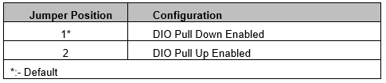
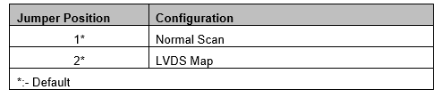
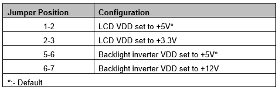

# 8. JUMPER CONFIGURATION

## 8.1 Serial Port & DIO Pu-PD Configuration \[JP1\]

The 2x6 2mm jumper JP1 is used to:

### 8.1.1 Select the protocol for the serial ports

The serial port protocol mode selection is as tabulated below:


By default, the serial ports' outputs are disabled to prevent any accidental damages to the port pair.



The protocol selection remains same for serial ports 1 & 2 and serial ports 3 &4 ie inserting a jumper on location 5 on JP1 configures the both serial ports 1 & 2 in RS-232 mode


### 8.1.2 Enable the pull-up or pull-down on the DIOs

The on-boards DIOs can be pulled up or down with the help of jumper JP1.The configurations are as tabulated below:

## 8.2 LVDS Scan & Mapping \[JP4\]

The 2x2 2mm jumper JP4 is used to set the scan direction & mapping for certain LVDS displays. The configurations are as tabulated below:

## 8.3 LVDS LCD Panel Voltage Select \[JP5\]

The 1x7 2.54mm jumper JP5 is used to configure the LVDS LCD panel voltages. The configurations are as tabulated below:

## 8.4 ISA IRQ \[JP6\]

The 2x9 2mm jumper JP6 is used to configure the IRQ for the COM & ADC IRQ. The configurations are as tabulated below:

## 8.5 Termination Enable for Serial Ports \[JP7, JP8\]

The two 2x5 2mm jumpers JP7 & JP8 are used to enable the 121E termination for the serial ports in RS-422 & RS-485 protocol modes. The configurations are as tabulated below:


In RS-232, make sure to remove all the jumpers as the serial ports might end up failing due to the 121E termination on the communication lines


## 8.6 SPI Select \[JP9\]

The 2x3 2mm jumper JP9 is used to configure the SPI lines to the FPGA SPI flash & enable the board power in absence of CoM. The configurations are as tabulated below:


Jumper on JP9 location 4 should never be mounted in presence of CoM. Mounting like this may damage the CoM


