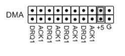

# I/O Line Pull-up/Pull-down Selection

Use jumper J8 to configure the pull-up and pull-down state of the counter/timer header pins \(J3\). Use jumper J11 to configure the pull-up and pull-down state of the DIO header pins \(J4\). DIO pin pull-up and pull-down state is configured as shown in the following examples. Jumper the position marked “+5” to pull the J3 I/O pins up to +5VDC.

Jumper the position marked “G” to pull the J3 I/O pins down to ground.

#### NOTE: Placing a jumper on both “+5” and “G” simultaneously will short the +5VDC power plane to ground.

