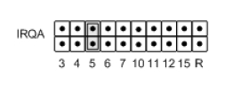

# Interrupt Level Selection

Jumper J7 is used to switch the IRQA interrupt and jumper J9 is used to switch the IRQB interrupt. PC/104 lines that can be selected are IRQ3 to IRQ7, IRQ10 to IRQ12 and IRQ15. \(The examples shown below also apply to the J9 jumper block for IRQB\). 

The example, below, shows J7 jumpered to route IRQA to PC/104 IRQ5.

Jumper blocks J7 and J9 are also used to enable interrupt sharing for each IRQ signal, enabling a 1K Ohm pull-down resistor. 

When an I/O module drives an IRQ line, its output signal must either drive logic high, or become a tri-state input. This allows more than one device to be on a single IRQ line. To facilitate this, a pull-down resistor is used on the IRQ line to bring the logic low when no device is signaling an interrupt. Shorting the “R,” resistor, jumper connects a 1K pull-down resistor between the IRQ line and ground. 

The following example shows IRQA connected to a 1K pull-down resistor and routed to IRQ5, which is shared. 

#### NOTE: There can only be one pull-down resistor per IRQ line. If jumper blocks J7 and J9 both select IRQ5, only one jumper block should have the R-jumper inserted. Likewise, there should only be one R-jumper in a configuration of multiple GPIO-MM boards.

#### NOTE: All positions are paralleled with zero-ohm resistor locations for hard-wire configuration. 

IRQA and IRQB interrupts sources are selected by configuring the enhanced feature register, 0Ch, as described in the Section 6, Register Bit Descriptions, Interrupt Source Register. 

#### NOTE: All positions are paralleled with zero-ohm resistor locations for hard-wire configuration.line pull-up/pull-down selection.

