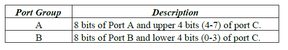
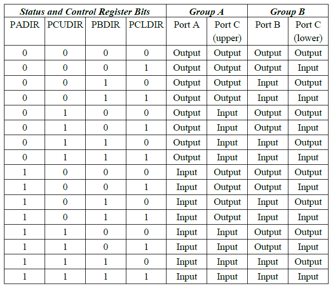

# 48-bit Programmable Direction \(8255\)

GPIO-MM provides 48 DIO lines using an FPGA core implementation of two 82C55A devices \(82C55A-1 and 82C55A-2\). The DIO functionality includes 48 programmable direction lines, and 8 fixed inputs and 8 fixed outputs. The 48 programmable I/O lines are buffered for enhanced output current, while the fixed I/O and the counter/timer signals feature ESD-protective circuitry. All I/O lines contain jumper-selectable 10Kohm pull-up/pulldown resistors. 

Operation of the 82C55A FPGA core should be as described in the 82C55A PPI datasheet. Refer to the 82C55A datasheet, Additional Information, for detailed register and programming information. 

The 82C55A has three parallel I/O ports. Ports A and B are 8-bit bi-directional I/O ports. Port C is divided into two 4-bit bi-directional I/O ports. For programming, the ports are arranged into two groups, as shown below.

#### NOTE: The port groups can be separately configured for different operating modes. However, GPIO-MM only implements operating mode 0, which provides simple, bidirectional I/O without handshaking. 

Port C bits may be individually set and reset by setting the MSFLAG in the 8255 Control and Status Register and programming the remaining register bits for the desired bit state. 

Setting the 8255 Control and Status Register to the following values gives 16 possible I/O configurations

