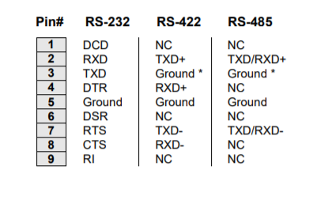

# 6.4 Serial Ports \(J8\)

Connector J8 provides access to the four serial ports of the Vortex CPU. The PORT1 and PORT2 ports are, independently, jumper-configurable for either RS-232, RS-485 or RS-422 protocol. Jumpers J25 and J26 are used to select the protocol. The PORT3 and PORT4 ports are fixed RS-232 protocol. All four serial ports can be independently enabled or disabled in the BIOS. 

The following tables list the signal assignments on the pin header for each serial protocol. 

In RS-422 and RS-485 modes, the ground on the 5th pin of each port exists only when the “485 GROUND” jumper is installed on jumper configuration blocks J25 and J26. Otherwise these pins are unconnected.

**Connector type**: Standard 2mm dual row straight pin header with gold flash plating

Serial ports are typically used with DB9 connectors. The PC / Helios side of the connection uses a male version of the connector and uses the DTE \(data terminal equipment\) pin assignment. The connecting cable will use a female version of the connector with DCE \(data communications equipment\) pinout. Diamond’s cable number 6981166 provides 4 DB9 connectors with DTE pinout. The following diagram shows the DB-9 male connector pin assignments for each protocol.

 In RS-422 and RS-485 modes, the ground on the 3rd pin of each DB9 connector exists only when the “485 GROUND” jumper is installed on jumper configuration blocks J25 and J26. Otherwise these pins are unconnected

