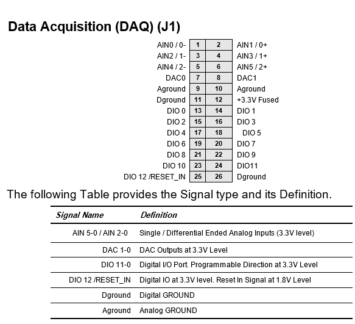

# Jethro

### Overview 

Jethro is a base board that converts NVIDIA Jetson TX2 module into a complete embedded system by providing interface circuitry, I/O connectors for all the major features of the module, camera interface, power supply and additional I/O capability.‌

Jethro redefines possibility; a combination of performance, power efficiency, integrated deep learning capabilities and rich I/O remove the barriers to a new generation of products‌

It also contains a PCIe MiniCard expansion socket, M.2 SATA module and Micro SD card for storage option.‌

### Features 

* Supports A/D channels 0-5\(single ended\), 0-2\(differential ended\) and 12 -15\(on-board voltage\)
* Supports A/D single ended and differential ended.
* Supports D/A conversion.
* Supports port A: 0-7\(8 bits\) and port B: 0-4\(5 bits\)
* Supports serial port \( 1 and 2\) configuration.
* Supports temperature read.
* Supports WLAN, LTE, FAN control & User Led.
* Supports 2 cameras.

### Pin out diagram

### Analog Input 

<table>
  <thead>
    <tr>
      <th style="text-align:left">&#x200B;</th>
      <th style="text-align:left">&#x200B;</th>
    </tr>
  </thead>
  <tbody>
    <tr>
      <td style="text-align:left">Max Input Channels:</td>
      <td style="text-align:left">
        
0 to 5 (Single ended)

        
0 to 2 (Differential ended)

      </td>
    </tr>
    <tr>
      <td style="text-align:left">A/D Resolution:</td>
      <td style="text-align:left">No oversampling : 12 bit</td>
    </tr>
    <tr>
      <td style="text-align:left">&#x200B;</td>
      <td style="text-align:left">Oversampling: 14 bit, 15 bit, 16 bit</td>
    </tr>
    <tr>
      <td style="text-align:left">Data range:</td>
      <td style="text-align:left">Single ended: 0 to 4095</td>
    </tr>
    <tr>
      <td style="text-align:left">&#x200B;</td>
      <td style="text-align:left">Differential ended: -2048 to 2047</td>
    </tr>
    <tr>
      <td style="text-align:left">Supported Conversion Triggers:</td>
      <td style="text-align:left">Software initiated A/D conversion</td>
    </tr>
    <tr>
      <td style="text-align:left">A/D Reference</td>
      <td style="text-align:left">External reference(3.3 V)</td>
    </tr>
  </tbody>
</table>

### Analog Output 

| ​ | ​ |
| :--- | :--- |
| Max Output Channels: | 2 |
| D/A Resolution: | 12 bits |
| Data range: | 0 to 4095 |

### Digital I/O 

<table>
  <thead>
    <tr>
      <th style="text-align:left">&#x200B;</th>
      <th style="text-align:left">&#x200B;</th>
    </tr>
  </thead>
  <tbody>
    <tr>
      <td style="text-align:left">Max Ports:</td>
      <td style="text-align:left">
        
Supports 2 DIO ports namely Port A &amp; Port B

        
(Port A - 0 to 7 bits, Port B - 0 to 4 bits)

      </td>
    </tr>
  </tbody>
</table>

### Jethro SAMD51 Functions 

* [​DSCSAM\_ADSample\(\) ​](../9.-samd51-apis/dscsam_adsample.md)
* ​[DSCSAM\_ADScan\(\) ​](../9.-samd51-apis/dscsam_adscan.md)
* ​[DSCSAM\_ADSetSettings\(\)](../9.-samd51-apis/dscsam_adsetsettings.md) ​
* ​[DSCSAM\_CAMERAControl\(\)](../9.-samd51-apis/dscsam_cameracontrol.md) ​
* ​[DSCSAM\_DAConvert\(\) ​](../9.-samd51-apis/dscsam_daconvert.md)
* ​[DSCSAM\_DIOBitConfig\(\)](../9.-samd51-apis/dscsam_diobitconfig.md) ​
* ​[DSCSAM\_DIOConfig\(\) ​](../9.-samd51-apis/dscsam_dioconfig.md)
* ​[DSCSAM\_DIOConfigAll\(\)](../9.-samd51-apis/dscsam_dioconfigall.md) ​
* ​[DSCSAM\_DIOInputBit\(\)](../9.-samd51-apis/dscsam_dioinputbit.md) ​
* ​[DSCSAM\_DIOInputByte\(\) ](../9.-samd51-apis/dscsam_dioinputbyte.md)​
* ​[DSCSAM\_DIOOutputBit\(\)](../9.-samd51-apis/dscsam_diooutputbit.md) ​
* [​DSCSAM\_DIOOutputByte\(\) ​](../9.-samd51-apis/dscsam_diooutputbyte.md)
* ​[DSCSAM\_FANControl\(\) ](../9.-samd51-apis/dscsam_fancontrol.md)​
* ​[DSCSAM\_FLASHRead\(\) ](../9.-samd51-apis/dscsam_flashread.md)​
* ​[DSCSAM\_FLASHWrite\(\) ](../9.-samd51-apis/dscsam_flashwrite.md)​
* ​[DSCSAM\_LEDControl\(\)](../9.-samd51-apis/dscsam_ledcontrol.md) ​
* ​[DSCSAM\_LTEControl\(\)](../9.-samd51-apis/dscsam_ltecontrol.md) ​
* [​DSCSAM\_SerialPortConfig\(\) ](../9.-samd51-apis/dscsam_serialportconfig.md)​
* ​[DSCSAM\_TemperatureSensorRead\(\)](../9.-samd51-apis/dscsam_temperaturesensorread.md) ​
* ​[DSCSAM\_WLANControl\(\)​](../9.-samd51-apis/dscsam_wlancontrol.md)

