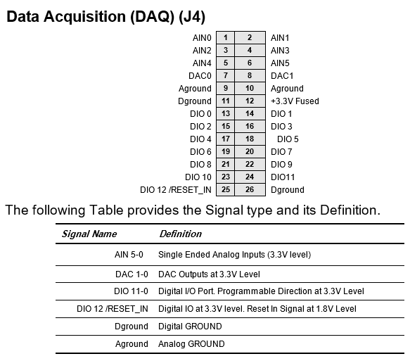

# Ziggy

### Overview

Ziggy is a Jetson TX2 module-based board with rich graphics and camera input capability. This base board converts Jetson TX2 module into a complete embedded system by providing interface circuitry, I/O connectors for all the major features of the module, camera interface, power supply and additional I/O capability.

Ziggy TX2 Base Board redefines possibility; a combination of performance, power efficiency, integrated deep learning capabilities and rich I/O remove the barriers to a new generation of products

The base board also contains a Micro SD card for storage option with all key I/O connectors placed along one edge for cable-free installation.

### Features

* Supports A/D channels 0-5\(external input\) and 12 -15\(on-board voltage\)
* Supports A/D single ended.
* Supports D/A conversion.
* Supports port A: 0-7\(8 bits\), port B: 0-4\(5 bits\) and port C: 0-7\(8 bits\).
* Supports temperature read.
* Supports FAN control & User Led.
* Supports 1 camera.

### Pin out diagram

### Analog Input

|  |  |
| :--- | :--- |
| Max Input Channels:                       | 0 to 5 \(Single ended\)                                                                                |
| A/D Resolution: | 12 bits |
| Data range: | 0 to 4095 |
| Supported Conversion Triggers: | Software initiated A/D conversion |
| A/D Reference  | External reference\(3.3 V\) |

### Analog Output

|  |  |
| :--- | :--- |
| Max Output Channels: | 2                                                                |
| D/A Resolution: | 12 bits |
| Data range: | 0 to 4095 |

### Digital I/O

<table>
  <thead>
    <tr>
      <th style="text-align:left"></th>
      <th style="text-align:left"></th>
    </tr>
  </thead>
  <tbody>
    <tr>
      <td style="text-align:left">Max Ports:</td>
      <td style="text-align:left">
        
Supports 3 DIO ports namely Port A, Port B and Port C.

        
(Port A have 0 to 7 bits,

        
Port B have 0 to 4 bits,

        
Port C have 0 to 7 bits.)

      </td>
    </tr>
  </tbody>
</table>

### Ziggy SAMD51 Functions

* [DSCSAM\_ADSample\(\) ](../9.-samd51-apis/dscsam_adsample.md)
* [DSCSAM\_ADScan\(\) ](../9.-samd51-apis/dscsam_adscan.md)
* [DSCSAM\_ADSetSettings\(\)](../9.-samd51-apis/dscsam_adsetsettings.md) 
* [DSCSAM\_DAConvert\(\)](../9.-samd51-apis/dscsam_daconvert.md) 
* [DSCSAM\_DIOBitConfig\(\) ](../9.-samd51-apis/dscsam_diobitconfig.md)
* [DSCSAM\_DIOConfig\(\)](../9.-samd51-apis/dscsam_dioconfig.md) 
* [DSCSAM\_DIOConfigAll\(\) ](../9.-samd51-apis/dscsam_dioconfigall.md)
* [DSCSAM\_DIOInputBit\(\)](../9.-samd51-apis/dscsam_dioinputbit.md) 
* [DSCSAM\_DIOInputByte\(\) ](../9.-samd51-apis/dscsam_dioinputbyte.md)
* [DSCSAM\_DIOOutputBit\(\)](../9.-samd51-apis/dscsam_diooutputbit.md) 
* [DSCSAM\_DIOOutputByte\(\)](../9.-samd51-apis/dscsam_diooutputbyte.md) 
* [DSCSAM\_FANControl\(\)](../9.-samd51-apis/dscsam_fancontrol.md) 
* [DSCSAM\_FLASHRead\(\)](../9.-samd51-apis/dscsam_flashread.md) 
* [DSCSAM\_FLASHWrite\(\)](../9.-samd51-apis/dscsam_flashwrite.md) 
* [DSCSAM\_LEDControl\(\) ](../9.-samd51-apis/dscsam_ledcontrol.md)
* [DSCSAM\_TemperatureSensorRead\(\)](../9.-samd51-apis/dscsam_temperaturesensorread.md)

